<!--
*** I'm using markdown "reference style" links for readability.
*** Reference links are enclosed in brackets [ ] instead of parentheses ( ).
*** See the bottom of this document for the declaration of the reference variables
*** for contributors-url, forks-url, etc. This is an optional, concise syntax you may use.
*** https://www.markdownguide.org/basic-syntax/#reference-style-links
-->
[![Contributors][contributors-shield]][contributors-url]
[![Forks][forks-shield]][forks-url]
[![Stargazers][stars-shield]][stars-url]
[![Issues][issues-shield]][issues-url]
[![MIT License][license-shield]][license-url]
[![LinkedIn][linkedin-shield]][linkedin-url]


<!-- PROJECT LOGO -->
<br />
<p align="center">
  <a href="https://github.com/vantrong291/wetravel">
    
  </a>

  <h3 align="center">WeTravel</h3>

  <p align="center">
    An React Native UI project
  </p>
</p>


<!-- TABLE OF CONTENTS -->
## Table of Contents

* [ScreenShots](#screenshots)
* [Built With](#built-with)
* [Getting Started](#getting-started)
  * [Prerequisites](#prerequisites)
  * [Installation](#installation)
* [License](#license)
* [Contact](#contact)


<!-- ABOUT THE PROJECT -->
## Screenshots

<div style="text-align: center"> 
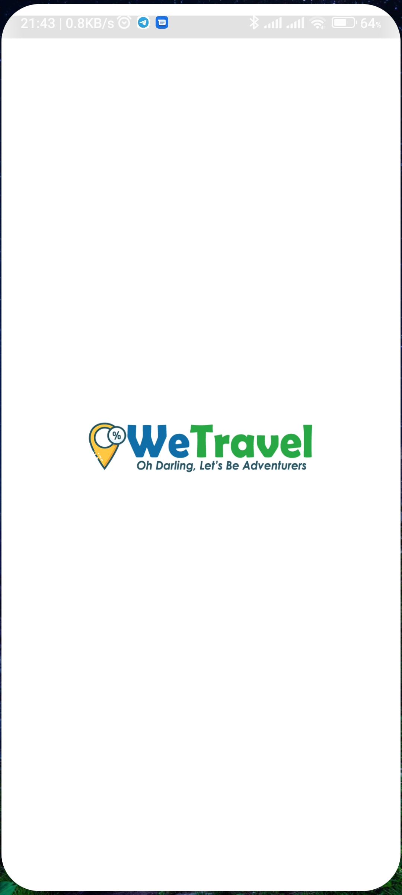
<p><em>Image 1: Splash Screen</em></p>
<br/>

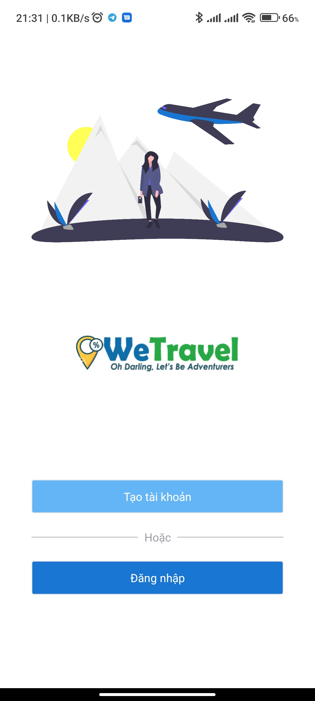
<p><em>Image 2: Login or Signup Screen</em></p>
<br/>

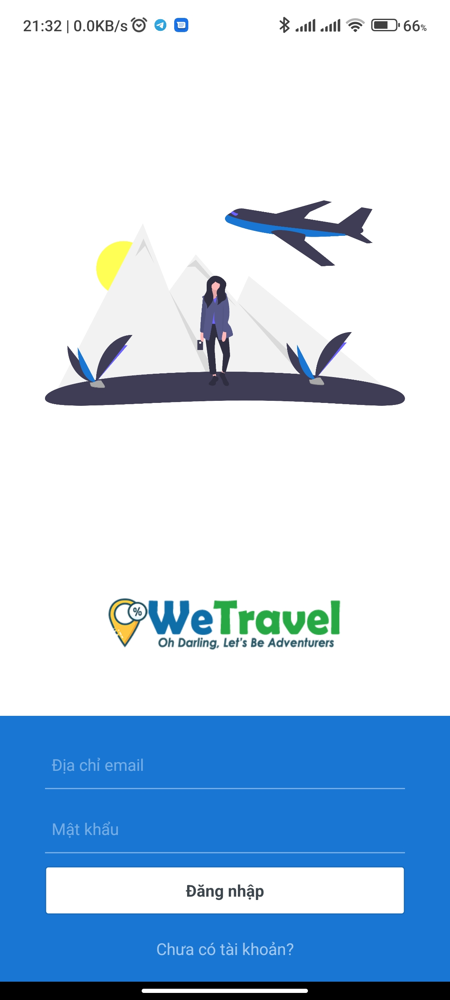
<p><em>Image 3: Login Screen</em></p>
<br/>

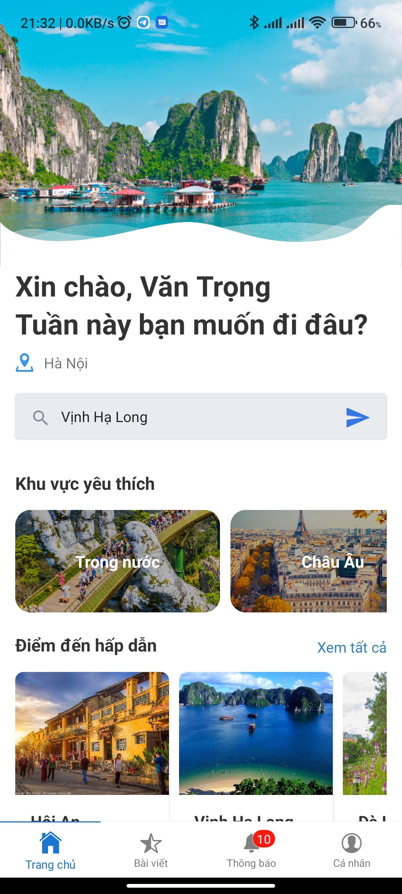
<p><em>Image 4: Home Screen</em></p>
<br/>

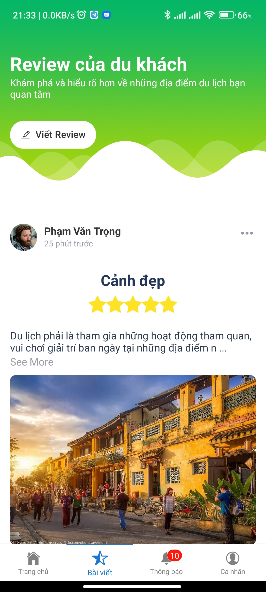
<p><em>Image 5: Reviews Screen</em></p>
<br/>


<p><em>Image 6: Notifications Screen</em></p>
<br/>

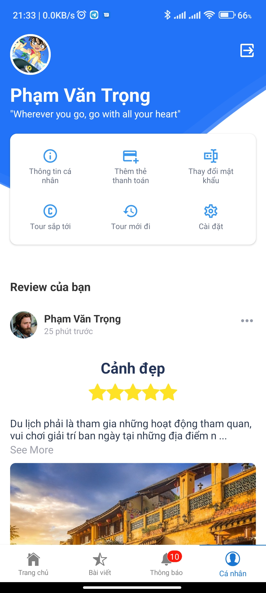
<p><em>Image 7: Account Info & Setting Screen</em></p>
<br/>

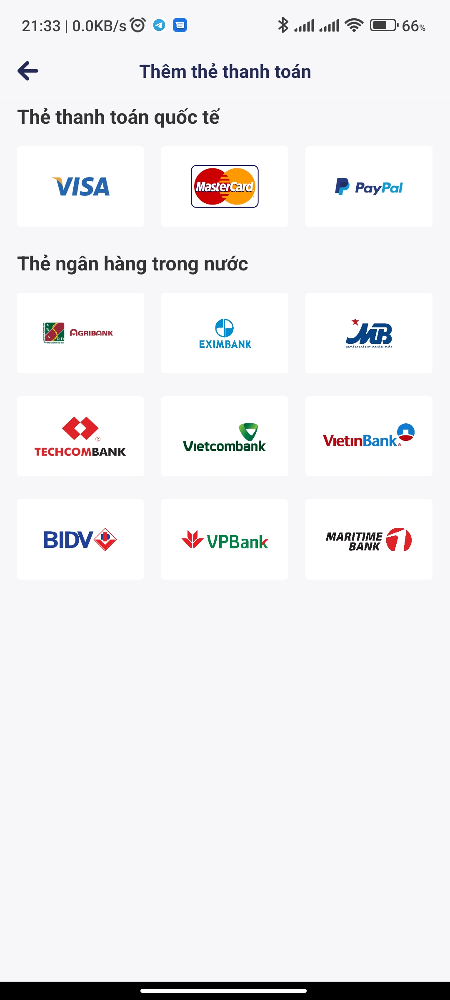
<p><em>Image 8: Payment Screen</em></p>
<br/>


<p><em>Image 9: Account Information Screen</em></p>
<br/>

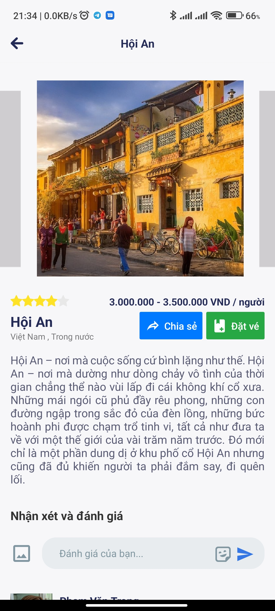
<p><em>Image 10: Tour Detail Screen</em></p>
<br/>

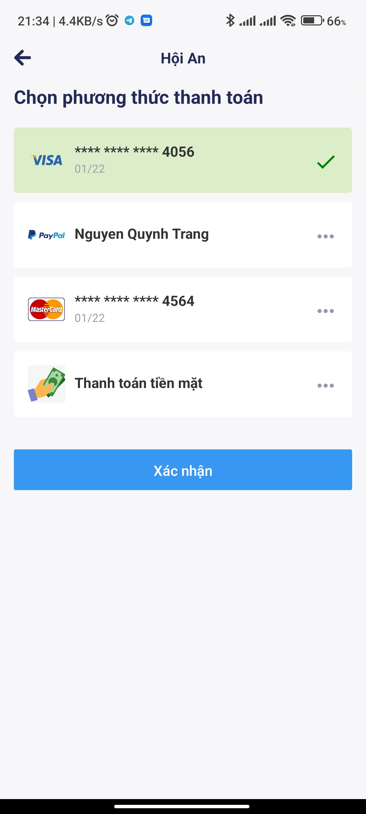
<p><em>Image 11: Select Payment Method Screen</em></p>
<br/>

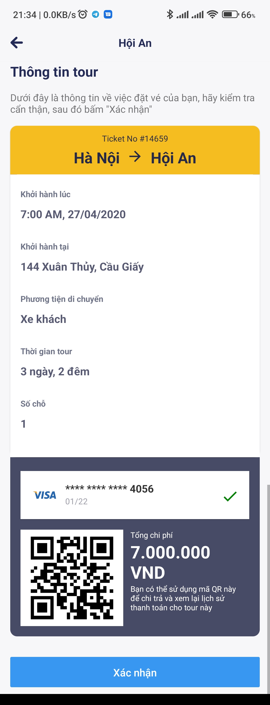
<p><em>Image 12: Ticket Overview Screen</em></p>
<br/>

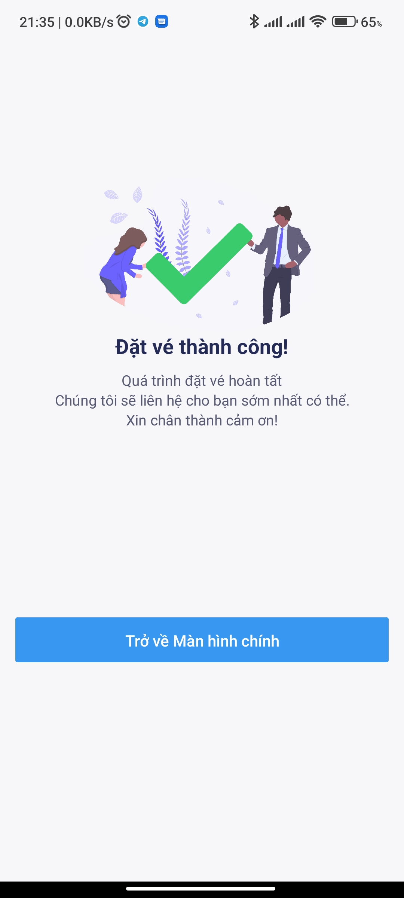
<p><em>Image 13: Success Payment Screen</em></p>
<br/>

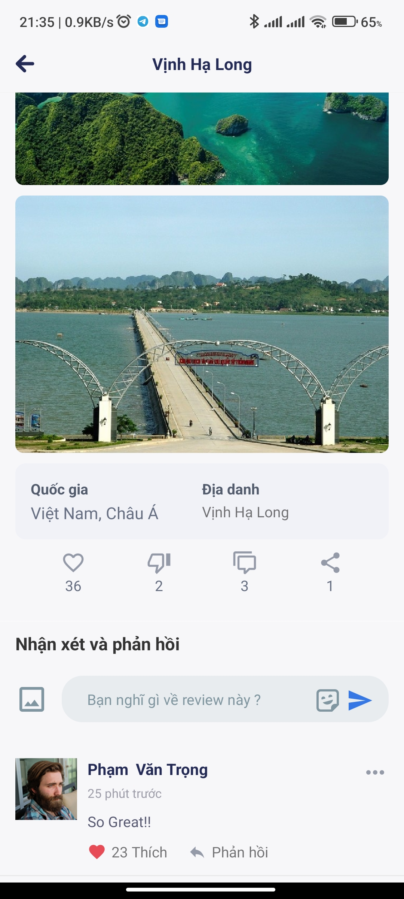
<p><em>Image 14: Review Detail Screen</em></p>
<br/>


</div>

[//]: # (Splash Screen ![Splash Screen!]&#40;App/Assets/Images/Screenshots/01-splash.jpg#10x20 "Splash Screen" &#41;)

[//]: # (Login or Signup Screen ![Login or Signup Screen!]&#40;App/Assets/Images/Screenshots/02-login-or-signup.jpg "Login or Signup Screen" &#41;)

[//]: # (Login Screen ![Login Screen!]&#40;App/Assets/Images/Screenshots/03-login.jpg "Login Screen" &#41;)

[//]: # (Home Screen ![Home Screen!]&#40;App/Assets/Images/Screenshots/04-home-tab.jpg "Home Screen" &#41;)

[//]: # (Reviews Screen ![Reviews Screen!]&#40;App/Assets/Images/Screenshots/05-review-tab.jpg "Reviews Screen" &#41;)

[//]: # (Notifications Screen ![Notifications Screen!]&#40;App/Assets/Images/Screenshots/06-noti-tab.jpg "Notifications Screen" &#41;)

[//]: # (Account Info & Setting Screen ![Account Info & Setting Screen!]&#40;App/Assets/Images/Screenshots/07-account-info-tab.jpg "Account Info & Setting Screen" &#41;)

[//]: # (Payment Screen ![Payment Screen!]&#40;App/Assets/Images/Screenshots/08-payment.jpg "Payment Screen" &#41;)

[//]: # (Account Information Screen ![Account Information Screen!]&#40;App/Assets/Images/Screenshots/09-account-info.jpg "Account Information Screen" &#41;)

[//]: # (Tour Detail Screen ![Tour Detail Screen!]&#40;App/Assets/Images/Screenshots/10-tour-detail.jpg "Tour Detail Screen" &#41;)

[//]: # (Select Payment Method Screen ![Select Payment Method Screen!]&#40;App/Assets/Images/Screenshots/11-select-payment.jpg "Select Payment Method Screen" &#41;)

[//]: # (Ticket Overview Screen ![Ticket Overview Screen!]&#40;App/Assets/Images/Screenshots/12-ticket-overview.jpg "Ticket Overview Screen" &#41;)

[//]: # (Success Payment Screen ![Success Payment Screen!]&#40;App/Assets/Images/Screenshots/13-success-payment.jpg "Success Payment Screen" &#41;)

[//]: # (Review Detail Screen ![Review Detail Screen!]&#40;App/Assets/Images/Screenshots/14-review-detail.jpg "Review Detail Screen" &#41;)


## Built With
* [React Native](https://facebook.github.io/react-native/)
* [React](https://reactjs.org/)


<!-- GETTING STARTED -->
## Getting Started

This is an instructions on setting up our project locally.
To get a local copy up and running follow these simple example steps.

### Prerequisites

Some prerequisites that you need to run locally.
* npm
```sh
npm install npm@latest -g
```
* react-native
```sh
npm install -g react-native-cli
```
* Android SDK
```1. Install Android Studio
Download and install Android Studio. Choose a "Custom" setup when prompted to select an installation type. Make sure the boxes next to all of the following are checked:

* Android SDK
* Android SDK Platform
* Android Virtual Device

Then, click "Next" to install all of these components.

If the checkboxes are grayed out, you will have a chance to install these components later on.

Once setup has finalized and you're presented with the Welcome screen, proceed to the next step.

2. Install the Android SDK
Android Studio installs the latest Android SDK by default. Building a React Native app with native code, however, requires the Android 9 (Pie) SDK in particular. Additional Android SDKs can be installed through the SDK Manager in Android Studio.

The SDK Manager can be accessed from the "Welcome to Android Studio" screen. Click on "Configure", then select "SDK Manager".

The SDK Manager can also be found within the Android Studio "Preferences" dialog, under Appearance & Behavior → System Settings → Android SDK.

Select the "SDK Platforms" tab from within the SDK Manager, then check the box next to "Show Package Details" in the bottom right corner. Look for and expand the Android 9 (Pie) entry, then make sure the following items are checked:

Android SDK Platform 28
Intel x86 Atom_64 System Image or Google APIs Intel x86 Atom System Image
Next, select the "SDK Tools" tab and check the box next to "Show Package Details" here as well. Look for and expand the "Android SDK Build-Tools" entry, then make sure that 28.0.3 is selected.

Finally, click "Apply" to download and install the Android SDK and related build tools.

3. Configure the ANDROID_HOME environment variable
The React Native tools require some environment variables to be set up in order to build apps with native code.

Add the following lines to your $HOME/.bash_profile or $HOME/.bashrc config file:

export ANDROID_HOME=$HOME/Android/Sdk
export PATH=$PATH:$ANDROID_HOME/emulator
export PATH=$PATH:$ANDROID_HOME/tools
export PATH=$PATH:$ANDROID_HOME/tools/bin
export PATH=$PATH:$ANDROID_HOME/platform-tools
```


### Installation

1. Clone the repo
```sh
git clone https://github.com/vantrong291/wetravel.git
```

2. Install NPM packages
```sh
npm install
```

3. Run it !
```sh
yarn r
```

<!-- LICENSE -->
## License

Distributed under the MIT License. See `LICENSE` for more information.


<!-- CONTACT -->
## Contact

vantrong291 - vantrong291@gmail.com

Project Link: [https://github.com/vantrong291/wetravel](https://github.com/vantrong291/wetravel)


<!-- MARKDOWN LINKS & IMAGES -->
<!-- https://www.markdownguide.org/basic-syntax/#reference-style-links -->
[contributors-shield]: https://img.shields.io/github/contributors/vantrong291/wetravel.svg?style=flat-square
[contributors-url]: https://github.com/vantrong291/wetravel/graphs/contributors
[forks-shield]: https://img.shields.io/github/forks/vantrong291/wetravel.svg?style=flat-square
[forks-url]: https://github.com/vantrong291/wetravel/network/members
[stars-shield]: https://img.shields.io/github/stars/vantrong291/wetravel.svg?style=flat-square
[stars-url]: https://github.com/vantrong291/wetravel/stargazers
[issues-shield]: https://img.shields.io/github/issues/vantrong291/wetravel.svg?style=flat-square
[issues-url]: https://github.com/vantrong291/wetravel/issues
[license-shield]: https://img.shields.io/github/license/vantrong291/wetravel.svg?style=flat-square
[license-url]: https://github.com/vantrong291/wetravel/blob/master/LICENSE.txt
[linkedin-shield]: https://img.shields.io/badge/-LinkedIn-black.svg?style=flat-square&logo=linkedin&colorB=555
[linkedin-url]: https://linkedin.com/in/vantrong291
[product-screenshot]: App/Assets/Images/Screenshots/screenshot01.png
